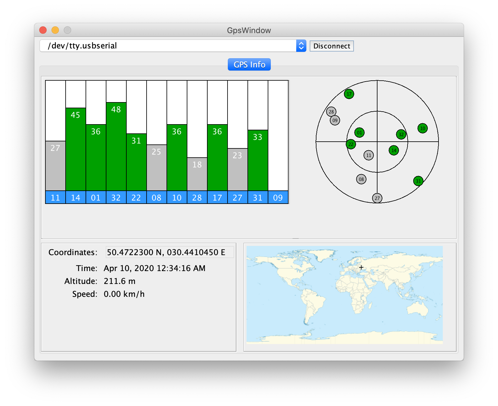

# Java GPS Info Application

## About
"Java GPS Info" is desktop application for displaying data about current postion and satellites info from GPS revceivers.

It uses [Java Marine API](https://github.com/ktuukkan/marine-api) library for decoding [NMEA 0183](http://en.wikipedia.org/wiki/NMEA_0183) messages and [Neuron Robotics Java Serial Library](https://github.com/NeuronRobotics/nrjavaserial) for serial port communication.

## Build and Run
1. Checkout the repository.

        $ git clone git@github.com:aitov/gps-info.git

2. Build with Maven.

        $ cd gps-info
        $ mvn install
        
3. The resulting JAR will be found at `target/gps-info.jar`.

4. With installed JRE double-click on gps-info.jar or run from command line.

        $ java -jar gps-info.jar
        
## Devices
This application was tested on:
* GlobalSat BU-353S4 - on MacOs and Windows (with PL2303 driver installed)

